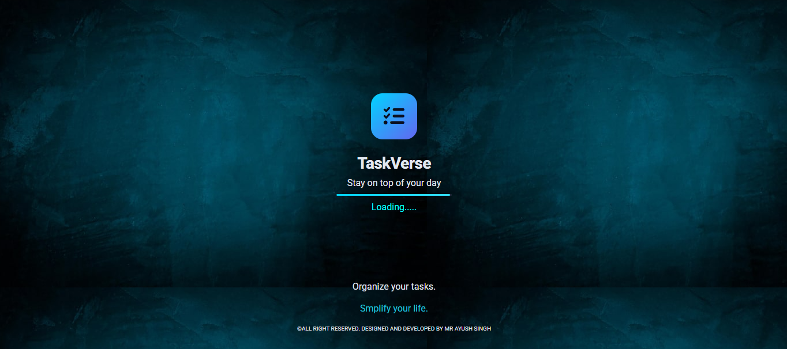
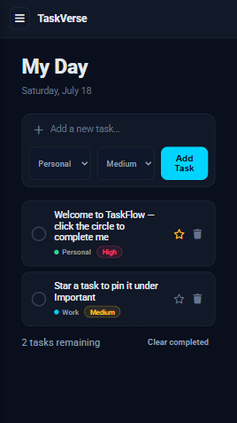

# TaskVerse 🚀

A modern, responsive, and smart task management web application built from scratch to help you organize daily workflows, track deadlines, and boost productivity.

## 🔗 Live Demo

Experience the live application here: **[TaskVerse Live Demo](https://taskverse-smart-task-manager.netlify.app/)**

---

## 📸 Screenshots

### Splash Screen

  

### Desktop Dashboard

  

### Mobile Dashboard

  

---

## 🌟 Features

* **Task CRUD Operations:** Seamlessly add, view, edit, and delete tasks.
* **Smart Categorization & Priority:** Organize tasks with customizable categories and priority levels (High, Medium, Low).
* **Due Date Tracking:** Integrated calendar and deadline tracking to keep you on schedule.
* **Search & Filter:** Quickly locate specific tasks using keyword search or dynamic filters (All, Pending, Completed).
* **Local Storage Persistence:** Your tasks are securely saved in your browser, ensuring no data is lost on refresh.
* **Responsive Design:** A sleek, mobile-friendly interface optimized for mobile phones, tablets, and desktop displays.

---

## 🛠️ Technologies Used

* **HTML5:** Semantic structure of the web application.
* **CSS3:** Styling, modern layouts, and responsive design.
* **JavaScript (ES6+):** Core functionality, DOM manipulation, and local storage management.

---

## 📖 Usage

1. **Add a Task:** Click the "Add Task" button, fill in the task details (Title, Description, Due Date, Priority), and save.
2. **Mark as Complete:** Click the checkmark/checkbox icon to toggle a task's status.
3. **Edit/Delete:** Use the edit icon to modify existing tasks or the trash icon to remove them.

---

## 🤝 Contributing

Contributions are what make the open-source community such an amazing place to learn, inspire, and create. If you have suggestions to improve TaskVerse, please fork the repository and submit a pull request.

---

## 📄 License

This project is licensed under the MIT License.
